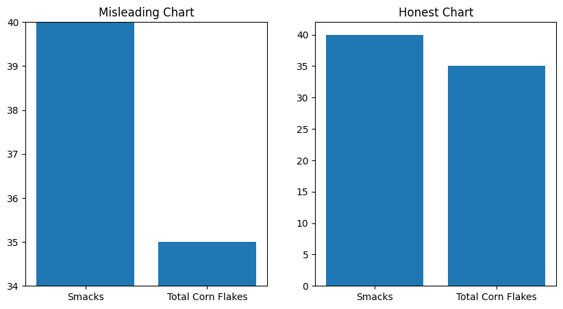
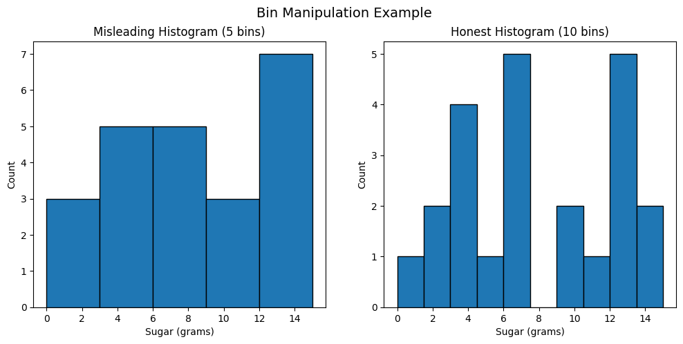
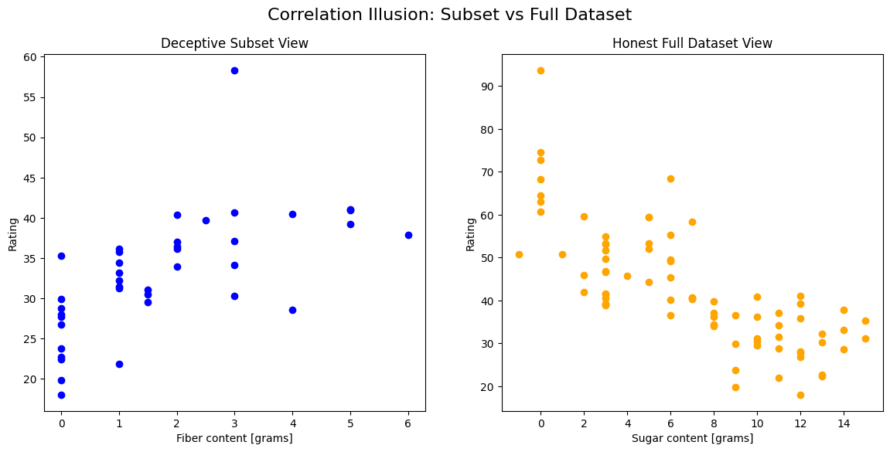

# Chapter 3: When Data Visualization Lies

## Overview
This project explores how visualization choices can influence interpretation, even when the data doesn’t change.

I run through examples where tiny tweaks in visualization (like changing axis scales, picking different histogram bins, or filtering certain data) can make trends look different than they actually are. 

## Core question
How much can perception change based on visualization design alone?

## Data Source
This project uses a public cereal nutrition dataset from Kaggle containing sugar, fiber, and consumer ratings
 https://www.kaggle.com/datasets/crawford/80-cereals

## My Projects
* [**01_truncated_axis.ipynb**](./01_truncated_axis.ipynb) : This demonstrates how manipulating the Y-axis range can exaggerate small trends.

* [**02_bin_manipulation.ipynb**](./02_bin_manipulation.ipynb) : This demonstrates how changing the width of bins in histograms can affect how we view data.

* [**03_correlation_illusion.ipynb**](./03_correlation_illusion.ipynb):
This demonstrates how cherry picking specific data subsets can hide strong negative correlations.

## What I Learned
Through this chapter, I realized that data visualization is as much about perception as it is about numbers. Even with the same dataset, subtle design choices can dramatically change how a viewer interprets the information. Specifically, I learned that:
* Axis scaling matters: Truncating or stretching axes can exaggerate or minimize trends, which can mislead viewers if not done carefully.

* Histogram bin size affects patterns: Changing the number of bins can make data appear more concentrated or more spread out than it really is.

* Peaks and clusters can be manipulated: Highlighting certain ranges or filtering data can create false impressions about what’s normal or typical.

* Critical thinking is key: As a data scientist, I need to ask whether a visual is showing the truth or just shaping perception, and communicate my findings responsibly.

* Transparency and context are essential: Always explain the choices I make in visualization and provide enough context so others can interpret the data accurately.

Overall, this chapter reinforced that visuals can lie, intentionally or not, and part of being a good data scientist is learning to spot these tricks and present data ethically.