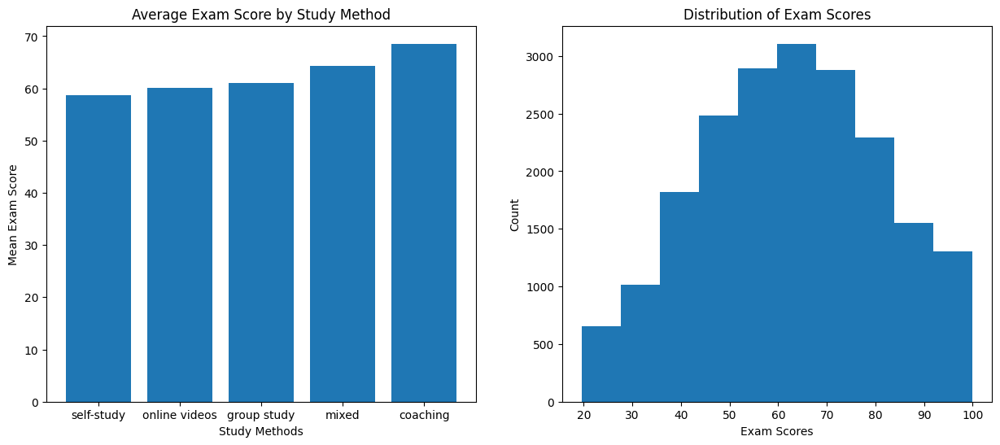
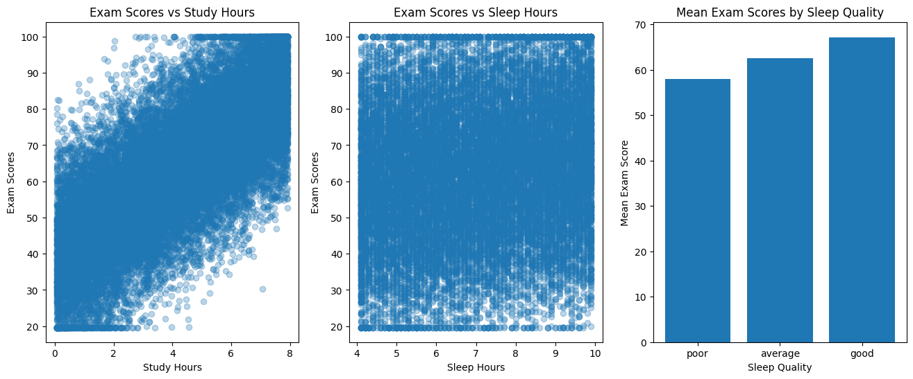
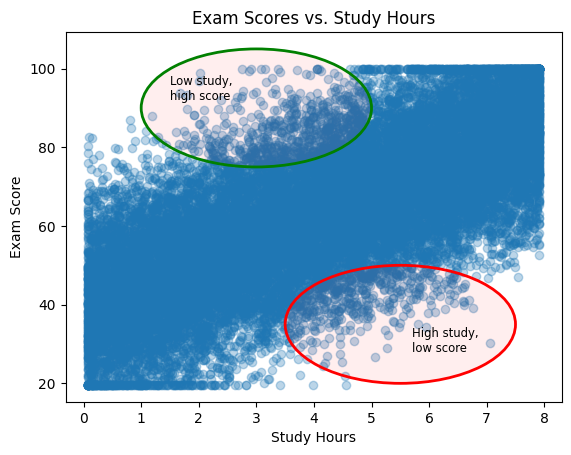

# Understanding Data with Statistics
## Overview
This chapter focuses on using statistics to understand data patterns, identify anomalies, and extract insights. I examined how different factors like study hours, sleep quality and sleep hours might affect exam performance. 

## Core Question
How can we use statistics to understand and question data?

## Data Source
This project used a dataset from Kaggle containing factors like study habits, sleep patterns, and learning environments.

https://www.kaggle.com/datasets/danishbaariq/analyze-effective-exam-score-to-sleep-quality-2026

## My Projects
* [**01_describing_data.ipynb**](./01_describing_data.ipynb): This notebook focuses on using descriptive statistics to examine the distribution, central tendencies, and variability of the exam performance dataset.

* [**02_relationships_in_data.ipynb**](./02_relationships_in_data.ipynb): This notebook focuses on the relationship between the columns in the dataset, and I identify which habits (studying more, sleeping longer, sleeping better) are the strongest predictors of success. 

* [**03_questioning_the_data.ipynb**](./03_questioning_the_data.ipynb): This notebook questions the dataset to see if there are unusual patterns or limitations in this dataset that affect how we interpret the results.

## What I Learnt
* I learnt that measures like mean, median, and standad deviation can are helpful in highlighting overall trends in data.
* I learnt that data is rarely perfect. Even in a small dataset, there can be anomalies. 
* I reinforced the knowledge that correlation does not imply causation.
* I learnt that questioning data is as important as describing it. Highlighting unusual patterns pushed me to think critically about what might be happening beyond the surface.
* I also finally understand how independent and dependent variables are assigned to axes, something I was surprised to realize I hadn’t fully grasped before.